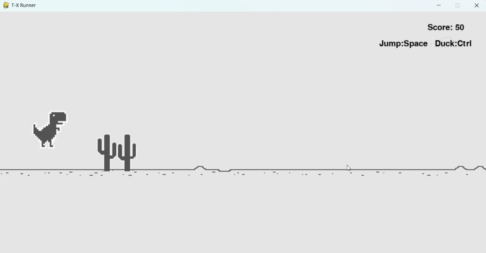

# Runner
恐龙快跑

## 目录结构

```
Runner/
├── Assets/              			# 资源目录
│   ├──	Bird/						# 鸟
│   ├──	Catus/                		# 仙人掌
│   ├──	Dino/						# 恐龙
│   └── Other/						# 场景
├──	Runner.py             			# 代码
├── background.oog					# 背景音乐
├── game_over.wav					# 淘汰音效
├── Pickup_Coin.wav					# 得分音效
├──	screenshot.png					# 运行截图
└── README_zh.md					# 说明文档
```

## 运行示例


